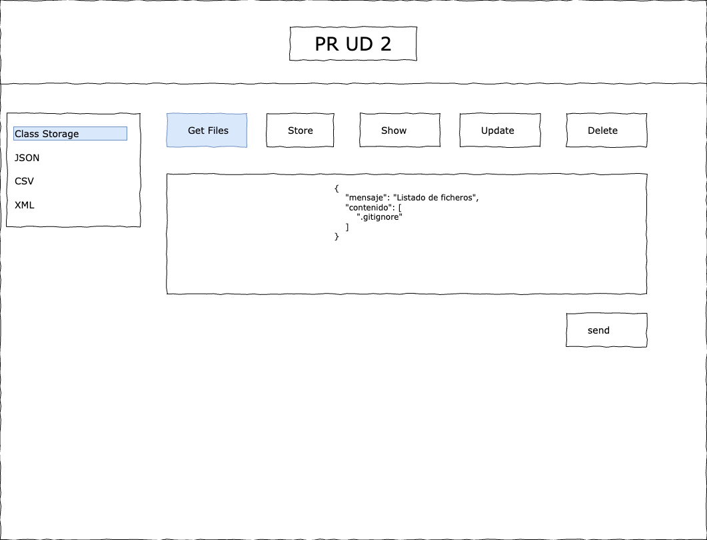

# Práctica 2: Cliente de una API Rest

## Descripción de la práctica

La práctica consiste en implementar un cliente que permita consumir la API REST que estamos definiendo durante los ejercicios:

-  *2.1 Clase Storage*
    - GET /api/hello
    - GET /api/hello/{filename}
    - POST /api/hello
    - PUT /api/hello/{filename}
    - DELETE /api/hello/{filename}
-  *2.1 JSON*
    - GET /api/json
    - GET /api/json/{filename}
    - POST /api/json
    - PUT /api/json/{filename}
    - DELETE /api/json/{filename}
-  *2.1 CSV*
    - GET /api/csv
    - GET /api/csv/{filename}
    - POST /api/csv
    - PUT /api/csv/{filename}
    - DELETE /api/csv/{filename}
-  *2.1 XML*
    - GET /api/xml
    - GET /api/xml/{filename}
    - POST /api/xml
    - PUT /api/xml/{filename}
    - DELETE /api/xml/{filename}

El objetivo de esta práctica ~~es superar la frustración que os generará~~ es aprender y conocer los requisitos para consumir API REST desde un cliente externo al backend (Headers, CORS, etc), por lo tanto, la tecnología y el diseño de este cliente es **libre**. Por ejemplo, para una aplicación web en VueJS, la implementación de la ruta `GET /api/hello` podría tener la siguiente apariencia:

### **Criterios de corrección:**

- [OBLIGATORIO] Se debe estructurar el proyecto de la siguiente manera:
    - 1 único repositorio para el frontend y el backend. Debe existir una carpeta `frontend` con el código del cliente y una carpeta `backend` con el código del backend.
- [OBLIGATORIO] Existe un README.md en la raíz del proyecto con una descripción clara y precisa de los requisitos y los pasos necesarios para levantar un entorno de desarrollo con frontend y backend.
- 8 puntos = 0,4p por cada ruta implementada.
- 2 puntos = puedo levantar un entorno de desarrollo local ejecutando:
    - `git clone <url repo>`
    - `docker compose up -d`

### **Entrega:**

- Se entregará la URL del repositorio en GitHub a través del Aula Virtual (igformacion.online).

## Debes saber ...

Una API REST (Representational State Transfer) es un conjunto de reglas que permite la comunicación entre sistemas mediante el uso de protocolos estándar de Internet, principalmente HTTP. A través de una API REST, una aplicación puede **acceder y manipular datos** alojados en un servidor backend desde otra aplicación o desde un frontend, sin necesidad de conocer cómo están almacenados o gestionados esos datos internamente.

### Conocimientos sobre el protocolo HTTP
- https://es.wikipedia.org/wiki/Protocolo_de_transferencia_de_hipertexto

### Características principales de una API REST

1. Arquitectura Cliente-Servidor: El cliente (como una aplicación frontend o un servicio externo) realiza solicitudes al servidor, que responde con los datos solicitados sin que el cliente necesite saber los detalles de la base de datos.

2. Operaciones CRUD: Las API REST suelen usar operaciones HTTP estándar para gestionar los datos, como:
    - GET para leer datos.
    - POST para crear nuevos datos.
    - PUT o PATCH para actualizar datos existentes.
    - DELETE para eliminar datos.

3. Stateless (Sin Estado): Cada solicitud HTTP realizada es independiente y no guarda el estado de las anteriores, lo que mejora la escalabilidad y simplicidad.

4. URL como Identificadores de Recursos: Cada recurso tiene una URL única, lo que permite acceder a ellos de manera sencilla y estructurada

Las API REST son esenciales porque permiten que distintas aplicaciones y servicios se integren y compartan datos de manera segura y eficiente. Esto facilita la creación de arquitecturas escalables y permite que distintos dispositivos y tecnologías trabajen juntos, lo cual es fundamental en el desarrollo de aplicaciones web, móviles y de escritorio.

### CORS

CORS (Cross-Origin Resource Sharing) es un mecanismo de seguridad implementado en navegadores web para restringir cómo los recursos (como datos o archivos) de un servidor pueden ser solicitados desde un dominio diferente al del servidor. Este sistema está diseñado para proteger a los usuarios de ataques malintencionados, como el Cross-Site Request Forgery (CSRF). https://en.wikipedia.org/wiki/Cross-origin_resource_sharing

- https://laravel.com/docs/11.x/routing#cors